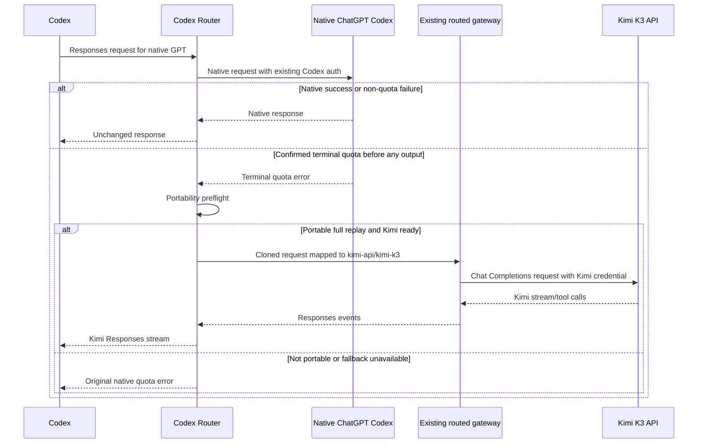

# Kimi K3 quota fallback for Codex Router

**Status:** User-approved architecture; independent design review passed
**Date:** 2026-08-09
**Target:** Codex Router `0.4.0-beta.2` at `16800ee39dc4499e3769fd2886f8ea93eb00ac9b`
**Primary user outcome:** Keep native ChatGPT/Codex as the default inference path and use Kimi K3 automatically only when the native account has genuinely exhausted its usage quota.

## Decision

Extend the downloaded Codex Router instead of installing CC Switch or configuring Claude as the fallback. The router will remain the sole owner of Codex's loopback routing configuration. Native OpenAI traffic will continue through the normal ChatGPT Codex backend with the existing Codex authentication. A new opt-in quota-fallback policy will make one Kimi K3 attempt only after a terminal native quota response, only before any response bytes or tool effects have reached Codex, and only when the current request contains a portable full replay.

The existing macOS menu-bar tray and top-center activity island remain the operator surface. Its Settings tab will gain a compact quota-fallback control and readiness status. When fallback is actually used, the existing activity and usage UI will naturally show Kimi as the active provider.

Repository defaults remain safe: the new policy ships off. This Mac may enable it because Ryan explicitly requested automatic Kimi fallback.

### Practical coverage boundary

This v1 is intentionally safe rather than universally seamless. Native Codex conversations commonly carry OpenAI-owned encrypted reasoning items after the first native assistant turn. If those items are present when quota exhaustion occurs, the router preserves the native quota error instead of guessing that they can be discarded. Automatic fallback is therefore dependable for fresh tasks and requests with a complete portable replay, but it may decline a handoff partway through an existing native task. Once a task is being answered by Kimi, its subsequent visible history remains portable. This limitation must appear in the tray help text and operator documentation; the UI must not promise that every in-progress task can switch providers.

## Why this architecture

Current Codex selects one model provider and custom providers speak the Responses API. Kimi K3's official API speaks Chat Completions, so direct `config.toml` fallback is not possible. This router already owns the required Responses-to-Chat translation, native Codex forwarding, provider credential isolation, Kimi request normalization, model catalog, usage accounting, doctor checks, and macOS tray.

The router's existing `native-redirect` feature is not sufficient. It redirects every native turn before contacting OpenAI and cannot use a native quota response as a trigger. Reinterpreting that feature would break its documented all-or-nothing behavior, so quota fallback gets separate state and commands.

CC Switch was considered because it has a polished cross-app GUI and generic failover. It is not selected because its documented failover covers broad failures and timeouts rather than terminal quota alone; installing it alongside Codex Router would create two owners for the same Codex configuration; and its open credential-storage issue does not meet this task's desired secret boundary. Claude remains a separate application/provider option, not an automatic continuation target for a live Codex task.

## Scope

### In scope

- Native ChatGPT/Codex remains primary while the user is signed in.
- Kimi Platform API model `kimi-k3` is the single fallback target for this installation.
- The global Kimi API endpoint is `https://api.moonshot.ai/v1`.
- Only terminal OpenAI account/subscription quota exhaustion can trigger fallback.
- Only ordinary `/responses` requests with explicit, portable conversation input can fall back.
- CLI/control-plane status, doctor visibility, sanitized event telemetry, and a macOS tray control are included.
- Installation preserves all unrelated Codex settings and authentication artifacts.
- Local models remain available through the router's existing experimental, keyless loopback provider, but local inference is not part of this fallback.

### Out of scope

- Generic high-availability failover for timeouts, network errors, overloads, authentication failures, or arbitrary HTTP errors.
- Falling back because the local task context window or Codex session budget is exhausted.
- Retrying after text, reasoning, a tool call, or any other semantic stream event has been forwarded.
- Automatic fallback for `/responses/compact`, `compaction_trigger`, image generation/edit routes, or server-state-dependent requests.
- Silent degradation of native opaque compaction, encrypted subagent payloads, or native reasoning ciphertext.
- A sticky provider switch after one quota event.
- Multi-provider chains, Claude fallback, CC Switch installation, or two routing controllers.
- Running Kimi K3 locally.
- A quota-consuming live model test without Ryan's separate approval.

## State and control plane

Add a protected, atomic state file beside `native-redirect.json`, with a deliberately separate schema:

```json
{
  "version": 1,
  "enabled": true,
  "model": "kimi-api/kimi-k3"
}
```

The state module must enforce mode `0600` on Unix, validate the exact registered model slug, reject native targets, and default to disabled when the file is absent. It must never store an API key, endpoint capability, prompt, response, or upstream error body.

Add control commands using the repository's existing command patterns:

```text
bin/control quota-fallback status [--json]
bin/control quota-fallback set kimi-api/kimi-k3
bin/control quota-fallback off
```

`status` reports only enabled/disabled, target slug, provider readiness, and the last sanitized outcome read from the existing local event stream. The configuration state file does not duplicate event history. `set` fails closed unless the target is registered, selected, and credential-ready. Disabling the policy never disables Kimi itself and never changes the user's current model.

The existing `native-redirect` policy keeps precedence. When it is enabled, native turns are converted to routed turns before a native OpenAI request is made, so quota fallback is not evaluated. Status and documentation must expose this interaction rather than implying that both policies can act on the same request.

The installed health/status snapshot exposes an optional quota-fallback object so older trays remain compatible. Doctor adds one scoped check:

- `OK` when the policy is off.
- `OK` when it is on and the target is registered, selected, and credential-ready.
- `WARN` when it is on but cannot currently route; native OpenAI remains usable.

## Exact trigger contract

Quota fallback is evaluated only for a completed, non-success native HTTP response whose body has not been forwarded. Refactor the existing pure quota classification from `error-translation.mjs` rather than adding a second list of strings.

The classifier may match terminal usage signals already covered by regression tests, such as `insufficient_quota`, `usage_limit_exceeded`, or an explicitly exhausted balance/plan. HTTP 429 alone is never sufficient. Preserve the current entitlement-before-quota precedence: overlapping `upgrade your plan` language must not turn a 403 plan-entitlement failure into a quota fallback.

The following must pass through unchanged and must not contact Kimi:

- Ordinary rate limiting, RPM/TPM throttling, or `Retry-After` backoff.
- Context-window, auto-compaction, or local session-budget errors.
- HTTP 400 schema/model failures.
- HTTP 401/403 authentication or entitlement failures.
- HTTP 5xx overloads and network/timeout failures.
- Safety/policy refusals.
- User aborts.

Read the candidate error body through a bounded decoder. If it is oversized, malformed, or ambiguous, return the original native response. Never log the body.

## Portability preflight

A native response ID belongs to OpenAI and cannot be sent to Kimi. Codex ordinarily resends conversation input, but native tasks can also contain opaque state that external models cannot read. Before a fallback attempt, require all of the following:

1. The route is ordinary `/responses`.
2. The request has an explicit replayable `input` array containing the current conversation.
3. The request is not a compact request and has no `compaction_trigger`.
4. No native opaque compaction payload is required for continuity.
5. No Fernet-like native `gAAAAA...` encrypted agent payload or other item would require the native relay.
6. No native reasoning ciphertext is required for continuation.
7. No response bytes or semantic events have been forwarded.

If any check fails, preserve and return the original native quota error. Transparent fallback must never replace missing context with the router's unreadable-history placeholder.

For a portable request, clone the parsed payload, delete OpenAI-owned `previous_response_id` and `client_metadata`, select the registered route `kimi-api/kimi-k3`, and pass the clone through a factored version of the existing routed-request preparation. That preparation resolves the route to its gateway model name; the external slug is not written directly into the gateway request. Do not globally strip previous response IDs: a direct external Responses provider can own valid IDs of its own.

## Request and response flow



There is no sticky provider state: each new native request probes OpenAI first, so OpenAI resumes automatically when the account quota resets. The fallback target is attempted once at the router layer. If Kimi fails before emitting output, return the original native quota error; if Kimi fails after output begins, surface that stream failure and never replay either provider.

Codex can retry a failed HTTP request at its own layer. To prevent one logical request from multiplying Kimi attempts, keep a bounded in-memory failure guard keyed by a SHA-256 digest of the decompressed request bytes plus route and native model. The guard stores no prompt or response content, is never persisted or logged, expires after 30 seconds, and is populated only when a Kimi attempt fails before output. A matching retry during that window returns the newly obtained original native quota response without another Kimi call. Successful fallback requests do not enter the guard.

## Credential and endpoint contract

The Kimi key must never appear in chat, command arguments, logs, tracked files, Codex config, or durable design artifacts. Setup uses the existing native secure field in the tray or the hidden PTY prompt; the control process receives it over standard input and stores it through the router's protected credential resolver.

Kimi K3 global accounts use `https://api.moonshot.ai/v1`, model `kimi-k3`, and `MOONSHOT_API_KEY`/the router's protected key path. The current checked-in `.cn` default is not valid for a global key. Update the `kimi-api` default to the current official global endpoint while preserving the existing allowlisted `KIMI_API_BASE_URL` override for operators who deliberately use another regional endpoint. Add a regression that the generated route and forwarder agree on the global default.

Because changing `.cn` to `.ai` can affect an existing Chinese-platform installation, include a CHANGELOG migration note and a doctor/readiness hint that names the `KIMI_API_BASE_URL` override without exposing its value. Existing regional operators must have a clear recovery path instead of silently losing readiness after update. The allowlisted non-secret override must be rendered into macOS, Linux, and Windows background-service definitions when configured; otherwise it would work in a foreground shell and disappear after installation.

The tray and doctor show only credential presence/source metadata and Kimi balance/readiness. They never read or render the key.

## macOS tray design

Keep the current native menu-bar popover, Settings tab, and top-center island. Add one small Settings section near Connections/Providers:

- Label: **Quota fallback**
- Toggle: **Use Kimi K3 when ChatGPT quota is exhausted**
- Summary states: `Off`, `Kimi K3 · ready`, or `Kimi K3 · needs API key`
- Help text: `Only confirmed account-quota exhaustion can switch providers. Rate limits, context limits, partial streams, and tasks with opaque native history stay on ChatGPT.`

The toggle calls the new control command through the existing validated command bridge. It is disabled while another provider operation is running. If applying the change fails, restore the prior state and show a sanitized error, matching existing provider-toggle behavior.

No second fallback dashboard is needed. The existing island already follows the provider handling the newest request, and the usage view already supports Kimi Platform balance plus local token history. A successful fallback therefore changes the active mark/detail to Kimi without special animation or a misleading claim that OpenAI is healthy.

The tray bundle is built locally from this stable checkout with `bin/model-router-tray`; there is no prebuilt app in the source tree. Installation/acceptance must prove the built bundle opens, the Settings control renders, state survives relaunch, and provider/activity focus changes correctly in a mock-driven fallback.

## Observability and accounting

Record one sanitized fallback event with timestamp, native provider, error class, fallback provider/model, outcome, and duration. Do not record prompt text, response text, error bodies, headers, response IDs, encrypted payloads, or credentials.

Usage accounting rules:

- The rejected native quota attempt records no model tokens.
- A successful Kimi response is attributed only to `kimi-api/kimi-k3`.
- A preflight rejection records a fallback-control outcome, not model usage.
- A failed Kimi attempt cannot double-count a Codex retry.

Existing status/activity APIs should carry the fallback provider during the Kimi attempt so the tray follows it naturally.

## Failure behavior

- Router unavailable: Codex sees the existing local router failure; no direct secret-bearing bypass is added.
- Kimi not configured/selected: native quota error is preserved and the tray says `needs API key` or not ready.
- Kimi authentication, quota, or server failure before output: native quota error is preserved; sanitized diagnostics distinguish fallback unavailability locally.
- Portability gate fails: native quota error is preserved with zero gateway/Kimi requests.
- Native response already started: never fall back.
- Kimi stream started then fails: surface the Kimi stream error; never replay.
- User abort: abort native or fallback work immediately and never start another upstream.
- Unknown/disabled target: policy cannot be enabled; stale state degrades to a doctor warning and native-only routing.

## Verification plan

All first-pass verification is local and non-billed.

### TDD and unit coverage

1. State/control tests: absent/off, set/status/off, atomic mode, invalid/native/disabled target, stale state, JSON output.
2. Quota-classifier tests: terminal quota positives and generic 429, Retry-After, context, auth, 5xx, safety, and malformed-body negatives.
3. Routing tests:
   - Native success remains native with zero Kimi calls.
   - Terminal quota plus portable full input makes exactly one Kimi call.
   - `previous_response_id` is removed only from the fallback clone.
   - Direct external Responses routing retains its provider-owned previous response ID.
   - Generic rate limit, entitlement 403, context, auth, 5xx, abort, and safety failures make zero Kimi calls.
   - `/responses/compact` and `compaction_trigger` never fall back.
   - Opaque compaction, encrypted agent payload, native reasoning ciphertext, or missing full replay preserve the native error and make zero relay/gateway calls.
   - Kimi-disabled/unhealthy failures preserve the native error.
   - A client-layer duplicate within the 30-second failure-guard window makes no second Kimi call; expiry permits a new attempt.
   - No fallback occurs after any streamed event/tool call.
   - Buffered negative paths preserve the original native status, selected headers, and exact body bytes.
   - `native-redirect` keeps precedence when both policies are enabled, with zero native quota probe.
   - Usage/activity attribution names Kimi once and does not double count.
4. Kimi endpoint regression: global base URL, exact `kimi-k3` model, auth replacement, normalized parameters, streaming, and tool calls.
5. Doctor/status snapshot regression, including backward-compatible optional tray fields.
6. macOS tray state decoding, toggle rollback, readiness copy, disabled/busy state, and accessibility labels.

### Repository verification

```text
npm run check
targeted node --test suites
npm test
sh -n install.sh
shell syntax checks for bin/*
Swift build/tests for ModelRouterTray
git diff --check
```

### UI acceptance

Build the native bundle from the reviewed checkout, open it, and inspect the real Settings surface. Verify the toggle, readiness state, provider activity change, reduced-motion behavior, and no secrets in UI/logs. Static Swift compilation alone is not UI acceptance. This Mac currently has Swift and the Command Line Tools but not full Xcode, so a successful build is an acceptance result to prove, not an assumption.

### Installation acceptance

After implementation and final review:

1. Keep vision bridge off before first install unless separately requested.
2. Let Ryan enter the Kimi key through `./bin/provider-key kimi-api set` in a hidden interactive terminal prompt; never pass it through chat, argv, or logs.
3. Install only `kimi-api` from the stable checkout, preserving unrelated Codex config and ChatGPT auth. The installer requires the selected provider to be credential-ready.
4. Run `bin/model-router codex doctor`; all core checks and the fallback check must pass.
5. Build and persist the tray with `./bin/model-router-tray`. Do not rely on `install.sh --with-tray` alone at this pinned version: it builds and opens the app but does not install the current launchd supervision.
6. Enable quota fallback from the tray.
7. Tell Ryan to fully quit/reopen Codex and start a new task; the installation task must not quit Codex itself.
8. Do not run a live Kimi or forced-quota request until Ryan separately approves the billed request.

## Rollback

The first rollback is the tray toggle or `bin/control quota-fallback off`; this returns routing to native-only without changing provider credentials or models. Repository rollback removes the new state/control/UI code and restores the prior Kimi endpoint default if required. Installation rollback uses the router's existing uninstall/config snapshot path, which restores only router-owned Codex fields and leaves ChatGPT authentication, unrelated Codex settings, credentials, logs, and retained state intact.

Never install CC Switch concurrently as a second Codex takeover layer.

## Review gates

This change is AI-harness model routing and therefore requires:

1. A fresh independent Fable design review of this exact architecture before production implementation.
2. A failing test before each production behavior change.
3. Fresh local verification after implementation.
4. A fresh independent Fable final review before commit/push or completion claims.
5. Secret-safe installation acceptance, with any billed live test separately authorized.

## Independent design approval

The task-specific read-only Fable review inspected the actual routing, error-classification, provider, Kimi, test-harness, Swift tray, and build-launcher sources. It returned exactly one standalone approval sentinel on 2026-08-09:

```text
FABLE_DESIGN: PASS
```

The six non-blocking findings from that review are incorporated above: entitlement precedence, honest opaque-history coverage, the regional endpoint migration note, `native-redirect` precedence, byte-fidelity regression coverage, and registry-to-gateway model resolution.

The prior Grok-only Fable design review does not approve this task.
